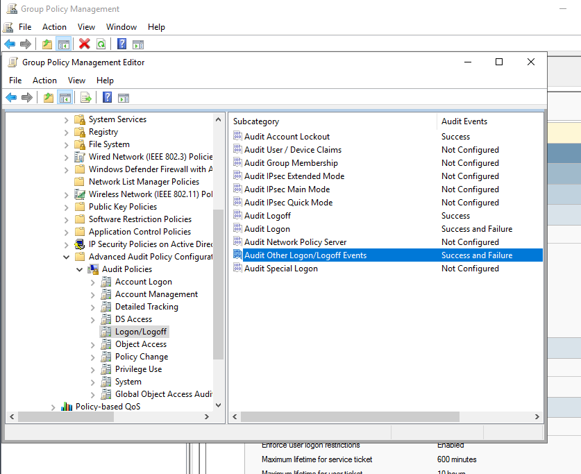
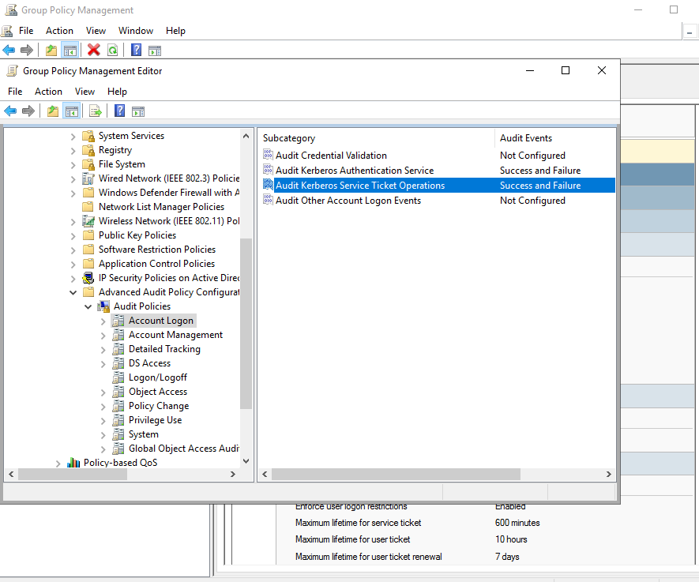
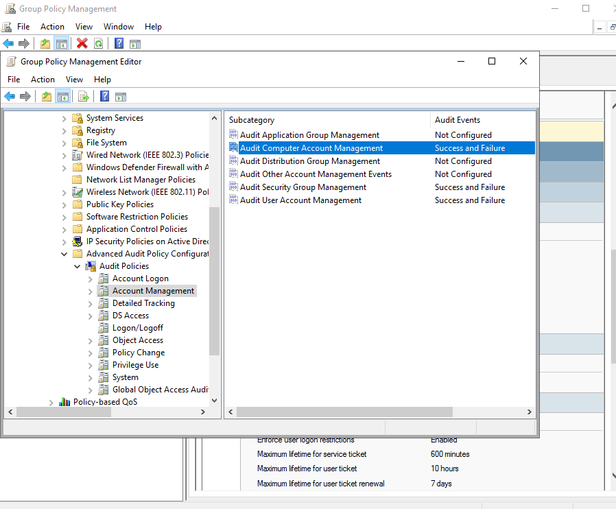
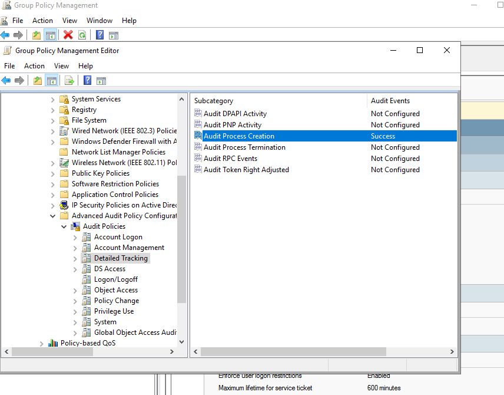
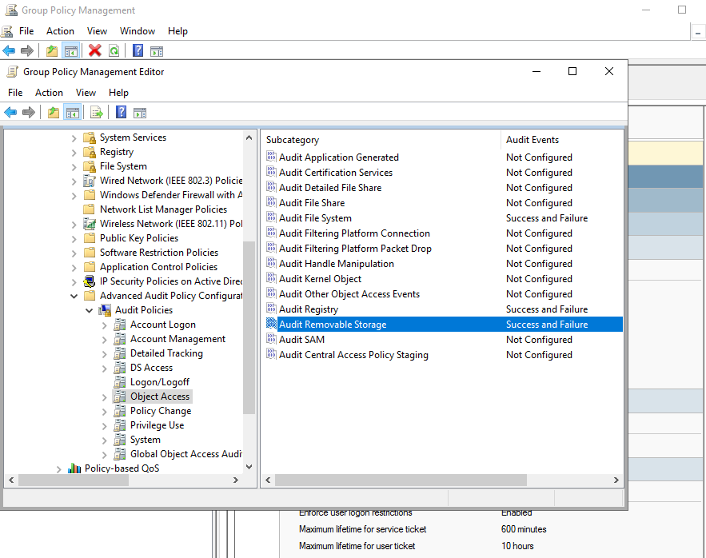

# Advanced Audit Policy Configuration

## Overview
Advanced auditing provides detailed visibility into authentication, authorization, account changes, and system activity. These logs are essential for SIEM monitoring, threat detection, and incident response.

## Categories Enabled
### Logon/Logoff
- Audit Logon: Success & Failure  
- Audit Logoff: Success  
- Audit Account Lockout: Success  
- Audit Other Logon/Logoff Events: Success & Failure  

### Account Logon
- Kerberos Authentication Service: Success & Failure  
- Kerberos Service Ticket Operations: Success & Failure  

### Account Management
- User Account Management: Success & Failure  
- Security Group Management: Success & Failure  
- Computer Account Management: Success & Failure  

### Detailed Tracking
- Process Creation: Success  

### Object Access
- File System: Success & Failure  
- Registry: Success & Failure  
- Removable Storage: Success & Failure  

## Why This Matters
These settings generate critical event IDs such as 4624, 4625, 4688, 4720–4732, 4768, and 4769. They provide the visibility needed to detect brute-force attacks, privilege escalation, suspicious PowerShell activity, and unauthorized access.

## Configuration Steps
1. Open Group Policy Management (`gpmc.msc`)
2. Edit the Default Domain Policy
3. Navigate to:
   `Computer Configuration → Policies → Windows Settings → Security Settings → Advanced Audit Policy Configuration → Audit Policies`
4. Enable the categories listed above

## Screenshots
- Logon/Logoff

- Account Logon

- Account Management

- Detailed Tracking

- Object Access

## Summary
Advanced auditing enables detailed monitoring and forms the foundation for SIEM integration and SOC analysis.
