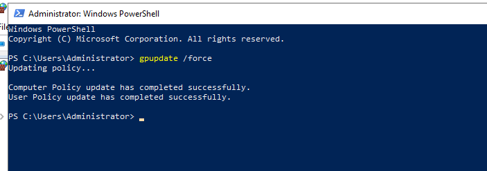
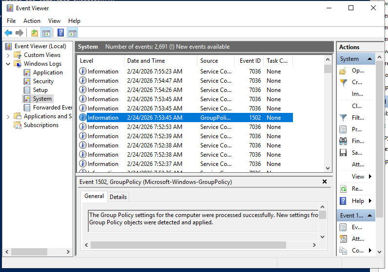

# Security Hardening

## Purpose
This section documents the security configurations applied to the Active Directory environment to reduce attack surface, enforce least privilege, and improve audit visibility.

## Components
### 1. Group Policy Objects (GPOs)
Located in `GPOs/`:
- Password policy
- Account lockout policy
- Kerberos policy
- User rights assignments
- Security options

### 2. Audit Policy
Located in `Audit-Policy/`:
- Logon/logoff events
- Account management
- Object access
- Process creation (Event ID 4688)
- Directory service access

### 3. Firewall Rules
Located in `Firewall-Rules/`:
- Inbound/Outbound rules
- Blocked ports
- Allowed services

### 4. Security Options
Located in `Security-Options/`:
- SMBv1 disabled
- Anonymous SID enumeration disabled
- Local account restrictions

## Documentation Format
Each subfolder includes:
- Overview of the setting
- Why it matters (Security+ alignment)
- Configuration steps
- Screenshots
- Summary

# GPO Verification

After completing all security hardening configurations, a `gpupdate /force` command was executed to apply the updated Group Policy Objects. The System event log was reviewed to confirm successful application with no errors.

## Why This Matters (Security+ Alignment)
- **Domain 4.0 – Operations & Incident Response:** Verifying that security controls are applied is part of configuration monitoring and change management.
- **Domain 3.0 – Implementation:** Ensures that hardening settings are active and enforced on the domain controller.
- **Domain 2.0 – Architecture & Design:** Confirms that the secure baseline is functioning as intended.

## Screenshots

