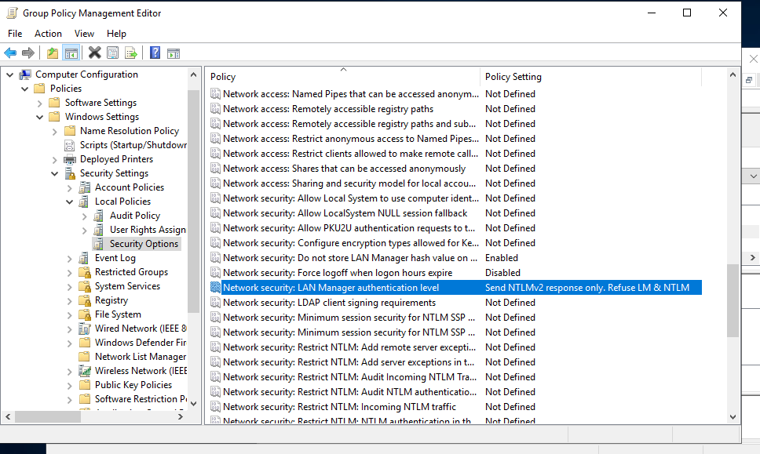
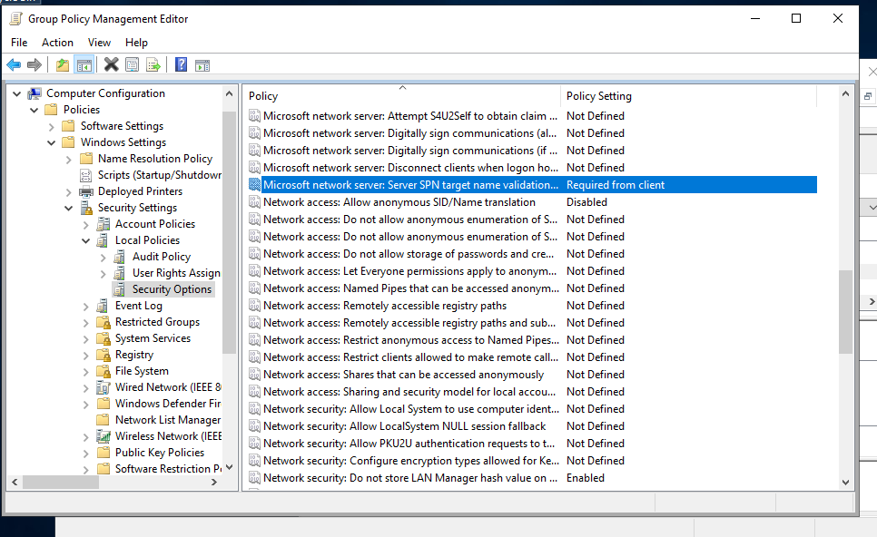
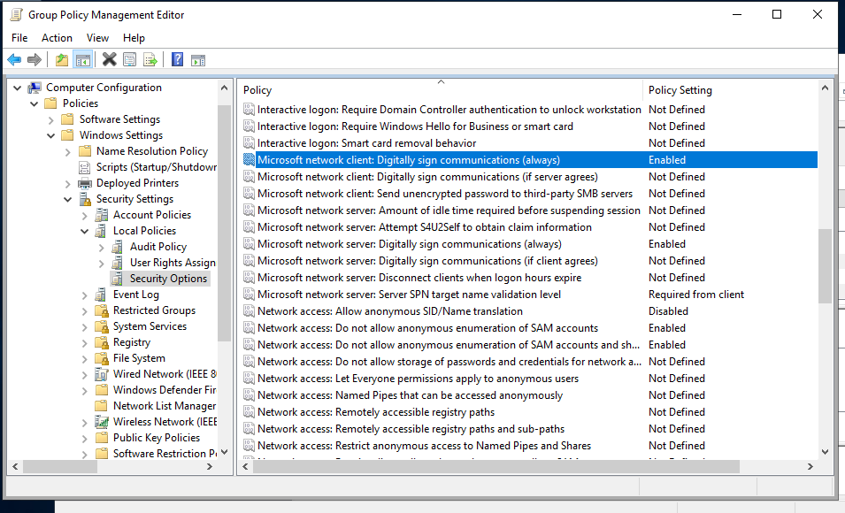
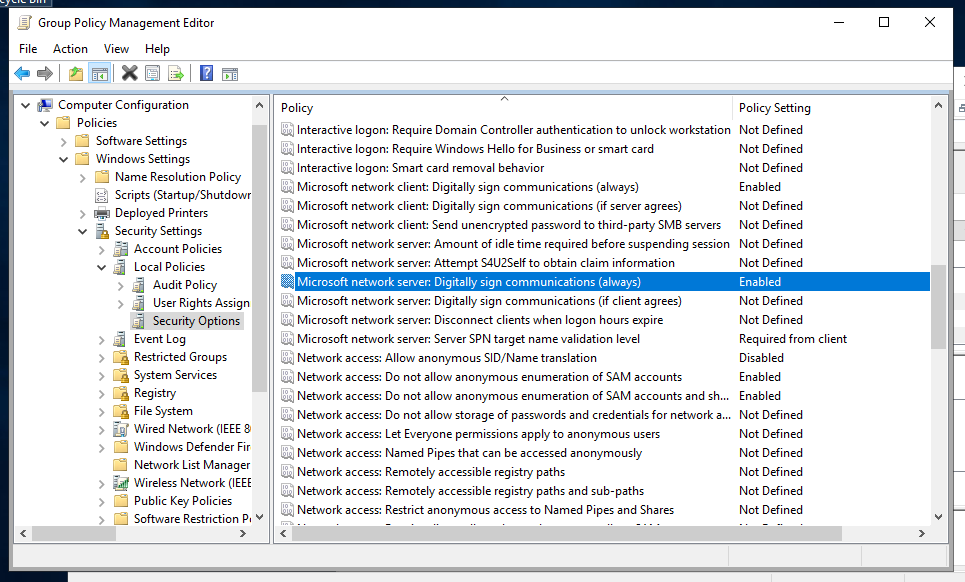
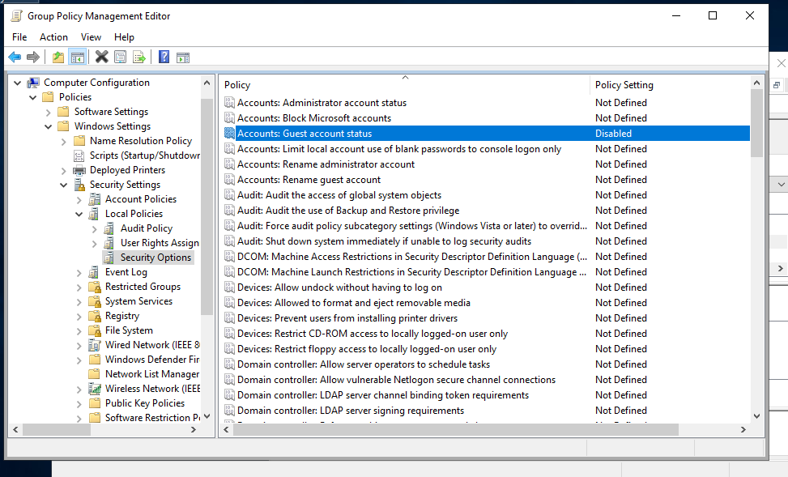
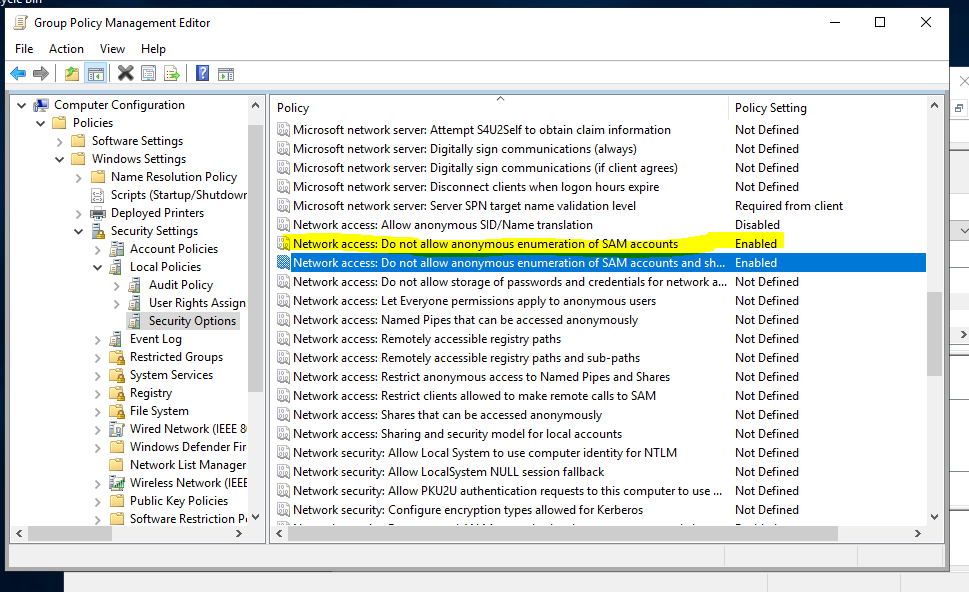

# Security Options Hardening

## Overview
Security Options provide granular control over authentication, network communication, and account behavior. These settings reduce attack surface, prevent legacy protocol abuse, and enforce secure communication across the domain.

## Settings Applied

### Network Security
- LAN Manager authentication level: Send NTLMv2 response only  
- SMBv1 disabled  
- Digitally sign client communications: Enabled  
- Digitally sign server communications: Enabled  

### Account Restrictions
- Guest account: Disabled  
- Administrator account: Disabled (if applicable)  
- Do not allow anonymous enumeration of SAM accounts: Enabled  
- Do not allow anonymous enumeration of SAM accounts and shares: Enabled  

## Why This Matters
These settings prevent credential downgrade attacks, block anonymous reconnaissance, enforce secure communication, and reduce exposure to legacy protocols. They align with Security+ Domain 3 (Implementation) and common enterprise hardening baselines.

## Configuration Steps
1. Open Group Policy Management (`gpmc.msc`)
2. Edit the Default Domain Policy
3. Navigate to:
   `Computer Configuration → Policies → Windows Settings → Security Settings → Local Policies → Security Options`
4. Apply the settings listed above

## Screenshots

### Network Security

**LAN Manager authentication level: Send NTLMv2 response only**

**SMBv1 disabled**

**Digitally sign client communications: Enabled**

**Digitally sign server communications: Enabled**

### Account Restrictions

**Guest account: Disabled**

**Administrator account: Disabled (if applicable)**

**Do not allow anonymous enumeration of SAM accounts: Enabled**

**Do not allow anonymous enumeration of SAM accounts and shares: Enabled**

## Summary
Security Options hardening strengthens authentication, reduces attack surface, and enforces secure communication across the domain.
